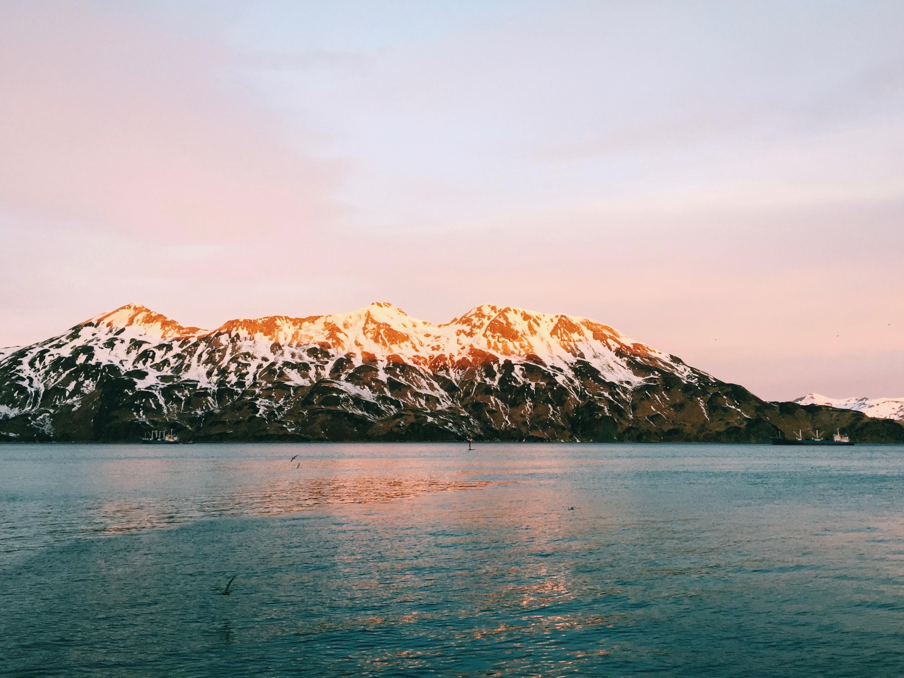
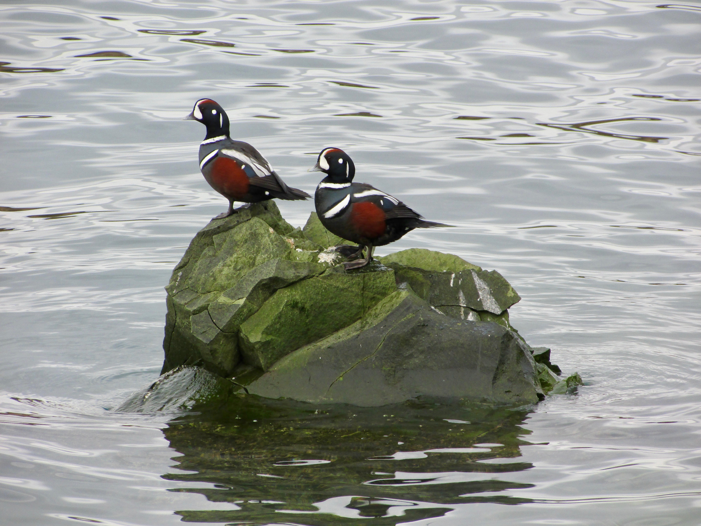
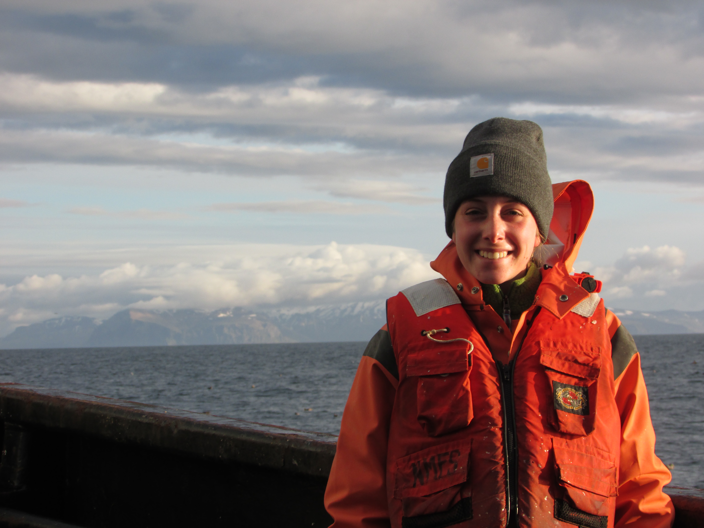

  

## About me 

Hi there, I'm Haley! I'm currently a PhD student at the University of British Columbia [Institute for the Oceans and Fisheries](https://oceans.ubc.ca/) working with [Murdoch McAllister](https://oceans.ubc.ca/murdoch-mcallister/).

#### Background

I received my BA in biology and sociology from [Colby College](https://www.colby.edu/) in 2015 and my MS in marine studies from the University of Delaware [College of Earth, Ocean, and the Environment](https://www.udel.edu/academics/colleges/ceoe/) in 2020 where I worked with [Aaron Carlisle](https://www.udel.edu/academics/colleges/ceoe/departments/smsp/faculty/aaron-carlisle/). 

My undergraduate research focused on how environmental change and management have influenced the social structure and dynamics of the Lobster fishing industry in Maine. After graduating  I worked as a [North Pacific Groundfish Observer](https://www.fisheries.noaa.gov/alaska/fisheries-observers/north-pacific-observer-program) for the National Marine Fisheries Service where I lived on commercial Pollock and Rockfish fishing vessels in the Bering Sea and Gulf of Alaska and collected data on catch, bycatch, and fishing effort to support stock assessment science. 

My work in Alaska sparked my interest in fish population dynamics and lead me to pursue my Master's at the University of Delaware. My Master's research focused on fish community dynamics and associated environmental drivers in the Delaware Bay using a long-term, state run trawl survey.

After graduating from UD I completed a [NOAA Sea Grant Knauss Marine Policy Fellowship](https://seagrant.noaa.gov/Knauss-Fellowship-Program) in 2021 working with the [NOAA Fisheries Office of Science and Technology](https://www.fisheries.noaa.gov/about/office-science-and-technology) National Stock Assessment Program.

#### Current Research

My research interests include quantitative fish ecology, population modeling, Bayesian fisheries assessment, and fisheries management evaluation. My PhD research will focus on understanding the ecological and socioeconomic impacts of pinnipeds (seals and sea lions) on British Columbia fisheries.

I'm passionate about making science, particularly quantitative and technical, inclusive and accessible to all. As I learn, [I will share](https://haleyoleynik.github.io/info.html). Please feel free to [reach out](https://haleyoleynik.github.io/Contact.html)! I'm always happy to chat about R, fisheries, modeling, Knauss, UD, UBC, etc. 

## TL;DR

I'm a PhD student and quantitative fish ecologist. I love fish, R, data, and modeling. 

 
 
 
